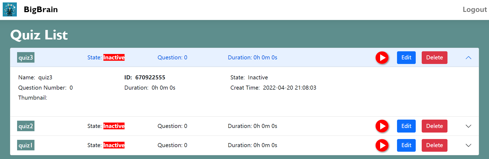
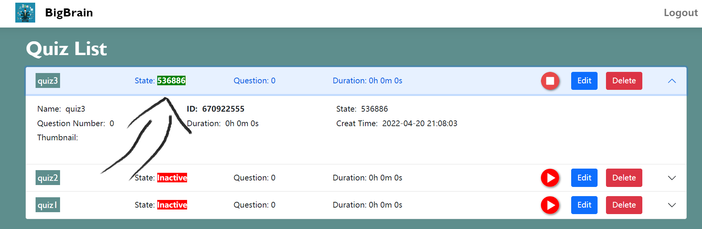
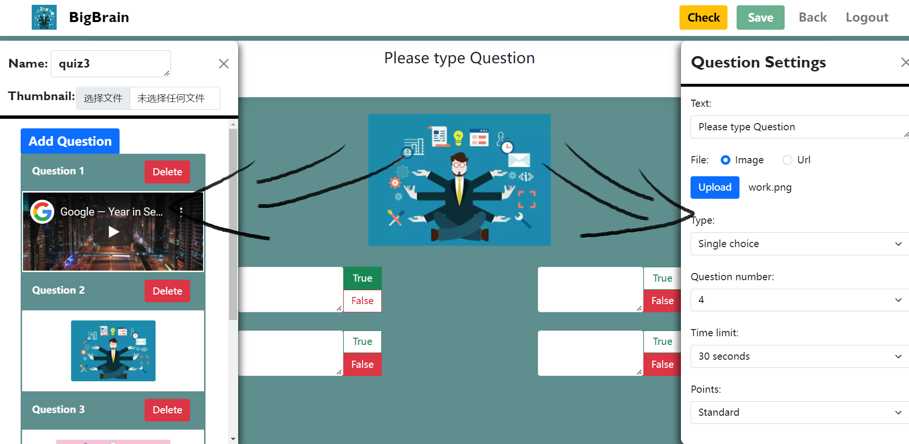
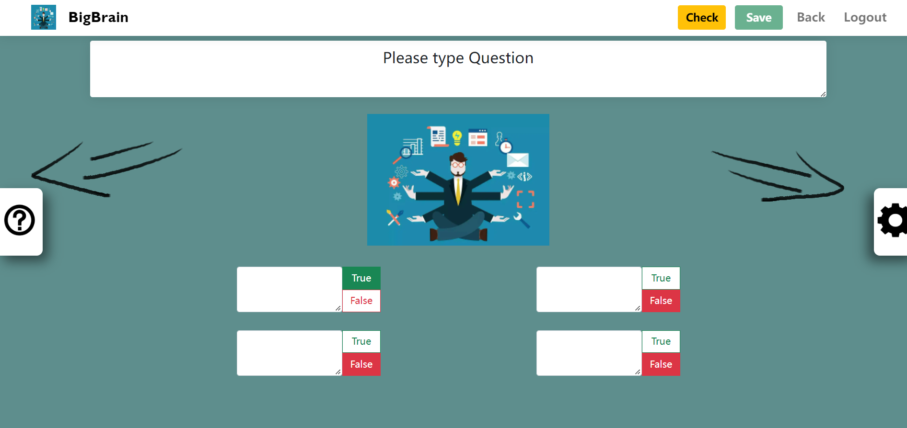
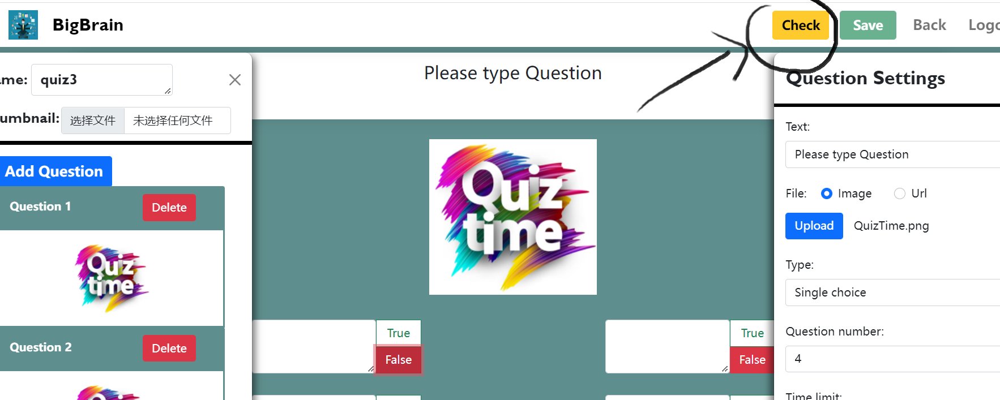
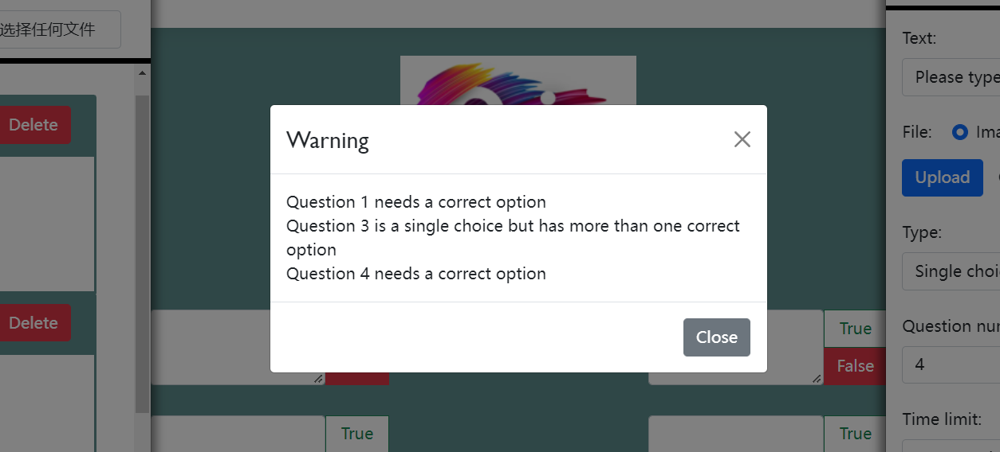
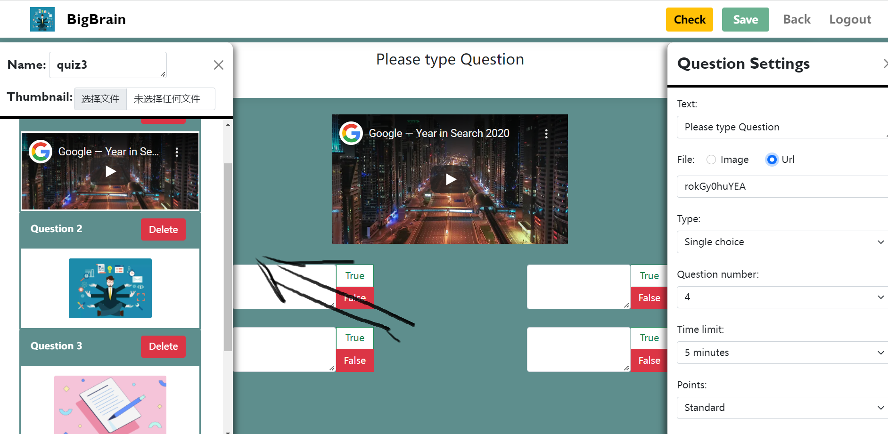

1. The basic colors are white and aquamarine blue. They have nice Contrast Compliance Level in https://designs.ai/ .

2. This website only use two font-family. 

3. In the Register, there is a password checking system to show if the password is equal to the ConfirmPassword.

4. The QuizList is Accordion. Users can see the main information of each quiz easily and also can unfold it to see more information. When people click delete quiz, there will be a modal to ask user again.

   

   When user start a quiz, the session ID will be shown on the Accordion.

   

5. Control panels in edit page can be closed and opened, which can show quizzes and questions in the larger view and make it easy for mobile phone users to operate.

   

   

6. In edit pages, there is a check system to check if there are invalid questions(no correct options or single choice question has more than one correct options). In this case, the save button will be disabled and there will a check button. User can see which question has problem and the type of problem.

   

   

7. The question panel has a window for each question to help user glance over all questions.

   
